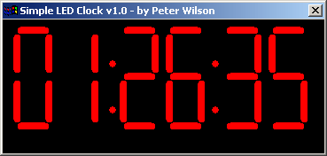



## LED Clock Challenge

### Description

Rodger threw down the challenge to write an LED clock application in a few lines as possible. This is my solution, can anyone better this! If not, you may all kneel trembling before me and worship me as your new programming god <insert evil laugh here> ;-p
 
### More Info
 

             |
---                |---
**Submitted On**   |2005-01-18 09:30:08
**By**             |[Peter Wilson](https://github.com/Planet-Source-Code/PSCIndex/blob/master/ByAuthor/peter-wilson.md)
**Level**          |Beginner
**User Rating**    |4.0 (24 globes from 6 users)
**Compatibility**  |VB 6\.0
**Category**       |[Graphics](https://github.com/Planet-Source-Code/PSCIndex/blob/master/ByCategory/graphics__1-46.md)
**World**          |[Visual Basic](https://github.com/Planet-Source-Code/PSCIndex/blob/master/ByWorld/visual-basic.md)
**Archive File**   |[LED\_Clock\_1841031182005\.zip](https://github.com/Planet-Source-Code/peter-wilson-led-clock-challenge__1-58343/archive/master.zip)

